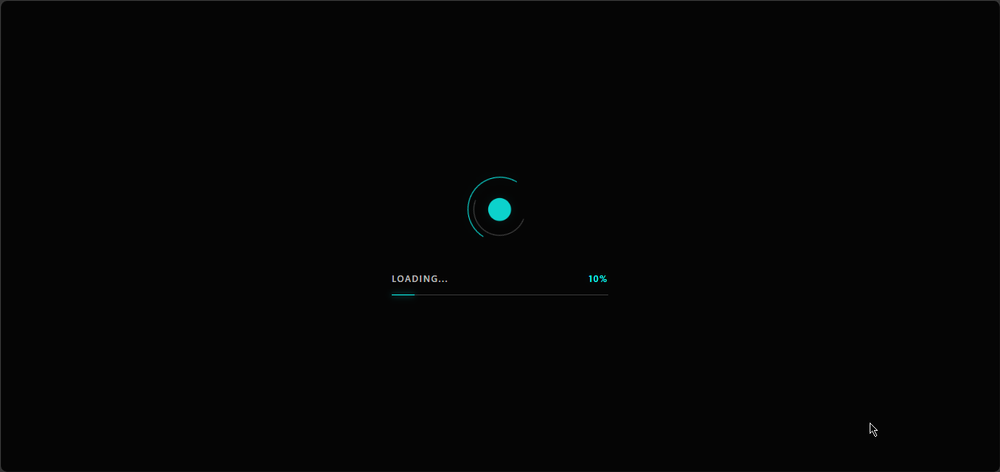

# ✨ Animasi Loading Futuristik

Loading screen modern yang dibuat menggunakan HTML, CSS, dan JavaScript murni. Proyek ini menampilkan animasi loader premium dengan desain minimalis, progress bar tipis, efek glow, serta transisi halus yang memberikan kesan profesional dan elegan.

## 📸 Preview



## ✨ Fitur

* Animasi loading modern dan minimalis
* Spinner dengan efek glow
* Progress bar tipis (thin line)
* Persentase loading real-time
* Animasi progress dinamis
* Efek fade out saat loading selesai
* Desain clean dan responsif
* Dibuat menggunakan HTML, CSS, dan JavaScript murni

## 🛠️ Teknologi yang Digunakan

* HTML5
* CSS3
* JavaScript

## 🚀 Cara Menjalankan

1. Download atau clone repository ini.
2. Buka file `index.html` menggunakan browser.
3. Loading screen akan berjalan secara otomatis saat halaman dimuat.

## 📂 Struktur Proyek

```text
├── index.html
├── preview.png
└── README.md
```

## 🎨 Desain

Proyek ini mengusung konsep UI modern dengan kombinasi warna gelap, aksen neon biru, efek glow yang lembut, serta animasi loading yang halus untuk menciptakan pengalaman visual yang premium.

## 📄 Lisensi

Proyek ini bebas digunakan untuk keperluan belajar, pengembangan, dan referensi pribadi.
